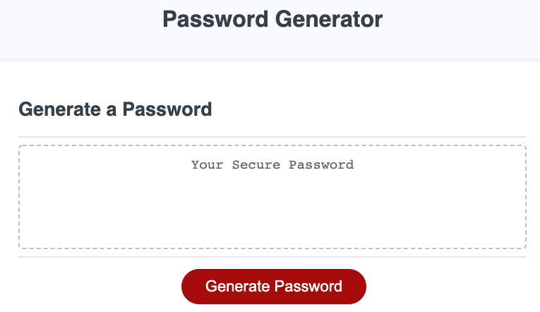

# Pass-Gen 🔐

Pass-Gen is a simple password generator built entirely on JS.

## Quirks 🎯

Pass-Gen gives the user the option to create a password anywhere from 8 to 128 characters long, using lowercase, uppercase, numbers, or special characters.

## Preview 👀

## License 📓
[MIT](https://choosealicense.com/licenses/mit/)